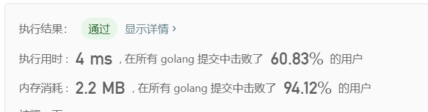
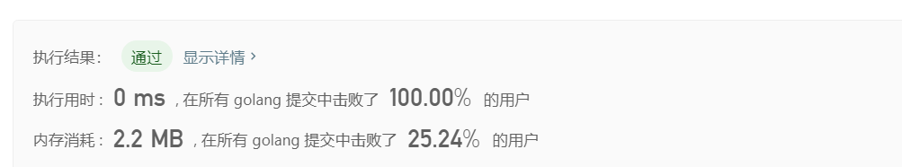

## 1103 plusOne


给定一个由整数组成的非空数组所表示的非负整数，在该数的基础上加一。

最高位数字存放在数组的首位， 数组中每个元素只存储单个数字。

你可以假设除了整数 0 之外，这个整数不会以零开头。

[9,9]>[1,0,0]

* python：

  ```python
  class Solution:
      def plusOne(self, digits: List[int]) -> List[int]:
          num_len = len(digits)
          num = 0
          for i in range(num_len):
              num += digits[i]*(10**(num_len-i-1))
          num += 1
          new = [None]*len(str(num))
          j = 0
          for i in str(num):
              new[j] = i
              j += 1
          return new
         
  ```

* Go

  ```go
  package main
  
  import (
  	"math"
  )
  
  func main() {
  	var a = []int{9, 9, 9}
  	plusOne(a)
  }
  
  //define the function
  func plusOne(digits []int) []int {
  	//trans to num
  	lenof := len(digits)
  	var num int = 0
  	for j, i := range digits {
  		var order int = lenof - 1 - j
  		num = num + i*int(math.Pow10(order))
  	}
  	Newnum := num + 1
  	//get the num of every bit
  	Newarr := []int{}
  
  	for int(Newnum/10) >= 1 {
  		Newarr = append(Newarr, Newnum%10)
  		Newnum = int(Newnum / 10)
  	}
  	Newarr = append(Newarr, Newnum)
  	Newarr2 := make([]int, len(Newarr))
  	for i, j := range Newarr {
  		Newarr2[len(Newarr)-1-i] = j
  	}
  	//reverse the arry
  	//fmt.Println(Newarr2)
  	return Newarr2
  }
  
  ```

  ### 最长公共前缀

  编写一个函数来查找字符串数组中的最长公共前缀。

  如果不存在公共前缀，返回空字符串 `""`。

```go
func longestCommonPrefix(strs []string) string {
	//find the shortest strting
	var shortest string
	if len(strs) <= 0 {
		return ""
	}
	shortest = strs[0]
	for _, s := range strs {
		if len(s) <= len(shortest) {
			shortest = s
		}
	}
	if len(shortest) <= 0 {
		return ""
	}

	max := 0
Stringrow:
	for i := 0; i < len(shortest); i++ {
		for _, s := range strs {
			if s[i] == shortest[i] {
				continue
			} else {
				break Stringrow
			}
		}
		max = max + 1
	}

	return shortest[:max]
}

```


题目很简单但做了好久，但是终究是第一次见到0ms，还是有点激动！！！

### 1115移除元素

给定一个数组 nums 和一个值 val，你需要原地移除所有数值等于 val 的元素，返回移除后数组的新长度。

不要使用额外的数组空间，你必须在原地修改输入数组并在使用 O(1) 额外空间的条件下完成。

元素的顺序可以改变。你不需要考虑数组中超出新长度后面的元素。

来源：力扣（LeetCode）
链接：https://leetcode-cn.com/problems/remove-element
著作权归领扣网络所有。商业转载请联系官方授权，非商业转载请注明出处。

Go：

```go
package main

import "fmt"

func main() {
	nums := []int{1, 2, 3, 5, 8, 5, 4, 2}
	val := 2

	fmt.Println(removeElement(nums, val))

}
func removeElement(nums []int, val int) int {
	for inornot(nums, val) == true {
		//in then remove
		remove(&nums, val)
	}
	fmt.Println(nums)
	return len(nums)

}

func inornot(nums []int, val int) bool {
	for _, i := range nums {
		if i == val {
			return true
		}
	}
	return false

}
func remove(nums *[]int, val int) {
	for index, i := range *nums {
		if val == i {
			*nums = append((*nums)[:index], (*nums)[index+1:]...)
			break
		}
	}
}

```

### 1116 开方

实现 int sqrt(int x) 函数。

计算并返回 x 的平方根，其中 x 是非负整数。

由于返回类型是整数，结果只保留整数的部分，小数部分将被舍去。

来源：力扣（LeetCode）
链接：https://leetcode-cn.com/problems/sqrtx
著作权归领扣网络所有。商业转载请联系官方授权，非商业转载请注明出处。

* Go

  使用二分法

  ```go
  package main
  
  import "fmt"
  
  func main() {
  	fmt.Println(mySqrt(4))
  }
  
  /*
  func mySqrt(x int) int {
  	result := 0
  	for result*result < x {
  		result++
  	}
  	if result*result == x {
  		return result
  	}
  	return result - 1
  
  }
  */
  func mySqrt(x int) int {
  	result := int((0 + x) / 2)
  	max := result
  	min := 0
  	for max != min {
  		if result*result > x {
  			max = result
  		} else if result*result < x {
  			if (result+1)*(result+1) > x {
  				return result
  			}
  			min = result
  		} else {
  			return result
  		}
  		result = int((max + min) / 2)
  	}
  	return x
  
  }
  
  ```

  



### 1117括号匹配问题

给定一个只包括 '('，')'，'{'，'}'，'['，']' 的字符串，判断字符串是否有效。

有效字符串需满足：

左括号必须用相同类型的右括号闭合。
左括号必须以正确的顺序闭合。
注意空字符串可被认为是有效字符串。

来源：力扣（LeetCode）
链接：https://leetcode-cn.com/problems/valid-parentheses
著作权归领扣网络所有。商业转载请联系官方授权，非商业转载请注明出处。

思路：

入栈与出栈。开括号入栈，遇到左括号就判断其与栈顶元素是否配对，如果不配对直接返回false，配对则出栈，继续遍历

Go：

```go
package main

import "fmt"

func main() {
	s := "{}{}[][{}}}}[))))))})]"
	fmt.Println(isValid(s))
}

func isValid(s string) bool {
	a := []string{}
	for _, i := range s {
		j := string(i)
		if j == "{" || j == "[" || j == "(" {
			//push
			a = append(a, j)
		} else {
			if len(a) == 0 {
				return false
			}
			if ispair(a[len(a)-1], j) {
				//pop
				a = a[:len(a)-1]
			} else {
				return false
			}

		}

	}
	if len(a) == 0 {
		return true
	}
	return false
}

//define one function to judge weather the bracket is one pair
func ispair(a string, b string) bool {
	switch a {
	case "(":
		return b == ")"
	case "{":
		return b == "}"
	case "[":
		return b == "]"
	}
	return false
}

```




