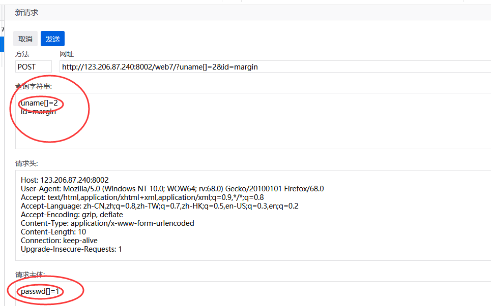

## 0731CTF

**bugku 正则？字符？**

```php
 <?php 
highlight_file('2.php');
$key='KEY{********************************}';
$IM= preg_match("/key.*key.{4,7}key:\/.\/(.*key)[a-z][[:punct:]]/i", trim($_GET["id"]), $match);
if( $IM ){ 
  die('key is: '.$key);
}
?> 
```

只要正则匹配上，就能显示flag

```python
.                                  匹配除 "\n" 之外的任何单个字符

*                                 匹配它前面的表达式0次或多次，等价于{0,}

{4,7}                           最少匹配 4 次且最多匹配 7 次，结合前面的 . 也就是匹配 4 到 7 个任意字符

\/                                匹配 / ，这里的 \ 是为了转义

[a-z]                           匹配所有小写字母

[:punct:]                     匹配任何标点符号

/i                                表示不分大小写
--------------------- 
作者：河马的鲸鱼 
来源：CSDN 
原文：https://blog.csdn.net/qq_26090065/article/details/81605837 
版权声明：本文为博主原创文章，转载请附上博文链接！
```

`/key.*key.{4,7}key:\/.\/(.*key)[a-z][[:punct:]]/i`

符合条件的字符串：keyakeyaaaakey:/a/keya.


**数组绕过 bugku 各种绕过**

为了让两者值不一样但是散列要一样

所以将值用数组传过去

```php
md5(array()) = null
sha1(array()) = null    
ereg(pattern,array()) = null vs preg_match(pattern,array) = false
strcmp(array(), "abc") = null
strpos(array(),"abc") = null
```

```php
 <?php
highlight_file('flag.php');
$_GET['id'] = urldecode($_GET['id']);
$flag = 'flag{xxxxxxxxxxxxxxxxxx}';
if (isset($_GET['uname']) and isset($_POST['passwd'])) {
    if ($_GET['uname'] == $_POST['passwd'])

        print 'passwd can not be uname.';

    else if (sha1($_GET['uname']) === sha1($_POST['passwd'])&($_GET['id']=='margin'))

        die('Flag: '.$flag);

    else

        print 'sorry!';

}
?> 
```



这样就能绕过。

**xff 与 Referer**

xff：表明源浏览器

referer：表明源ip

**web8**

PHP trim() 函数:移除字符串两侧的空白字符或其他预定义字符。

